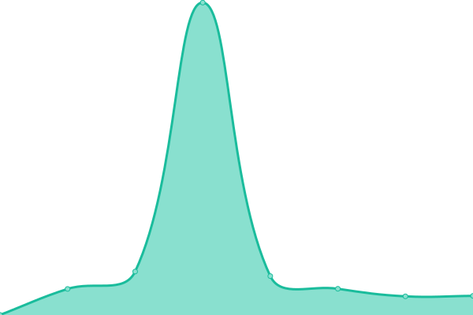
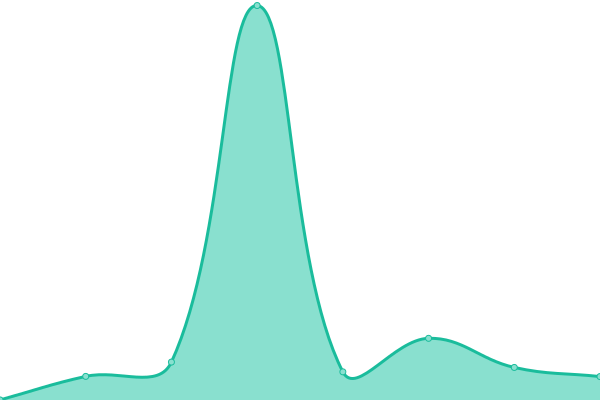

# [📈 Live Status](https://WalletInc.github.io/status): <!--live status--> **🟥 Complete outage**

This repository contains the open-source uptime monitor and status page for [Wallet Inc.](https://wallet.inc), powered by [Upptime](https://github.com/upptime/upptime).

With [Upptime](https://upptime.js.org), you can get your own unlimited and free uptime monitor and status page, powered entirely by a GitHub repository. We use [Issues](https://github.com/WalletInc/status/issues) as incident reports, [Actions](https://github.com/WalletInc/status/actions) as uptime monitors, and [Pages](https://WalletInc.github.io/status) for the status page.

<!--start: status pages-->
<!-- This summary is generated by Upptime (https://github.com/upptime/upptime) -->
<!-- Do not edit this manually, your changes will be overwritten -->
<!-- prettier-ignore -->
| URL | Status | History | Response Time | Uptime |
| --- | ------ | ------- | ------------- | ------ |
|  Administrative Portal | 🟥 Down | [administrative-portal.yml](https://github.com/WalletInc/status/commits/HEAD/history/administrative-portal.yml) | 

 626ms
     
 | 

<a href="https://uptime.wallet.inc/history/administrative-portal">98.29%</a>
    

|  API | 🟥 Down | [api.yml](https://github.com/WalletInc/status/commits/HEAD/history/api.yml) | 

 440ms
     
 | 

<a href="https://uptime.wallet.inc/history/api">100.00%</a>
    

<!--end: status pages-->

[**Visit our status website →**](https://WalletInc.github.io/status)

## 📄 License

- Powered by: [Upptime](https://github.com/upptime/upptime)
- Code: [MIT](./LICENSE) © [Wallet Inc.](https://wallet.inc)
- Data in the `./history` directory: [Open Database License](https://opendatacommons.org/licenses/odbl/1-0/)
